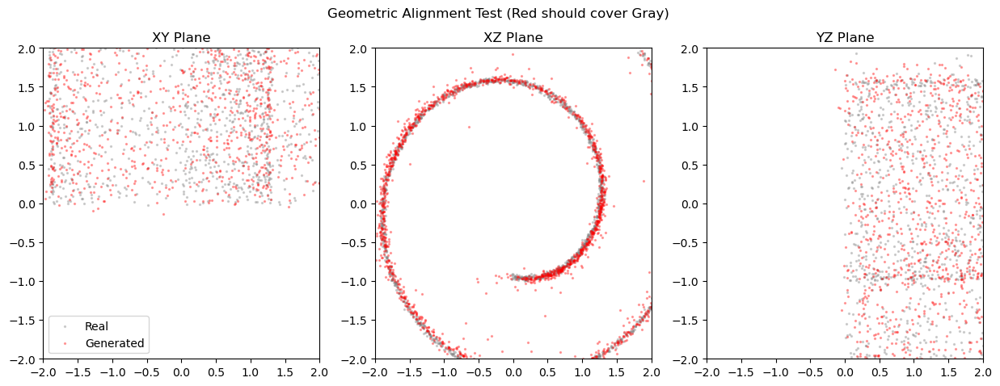
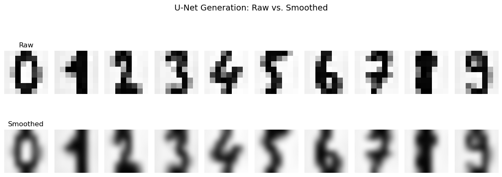
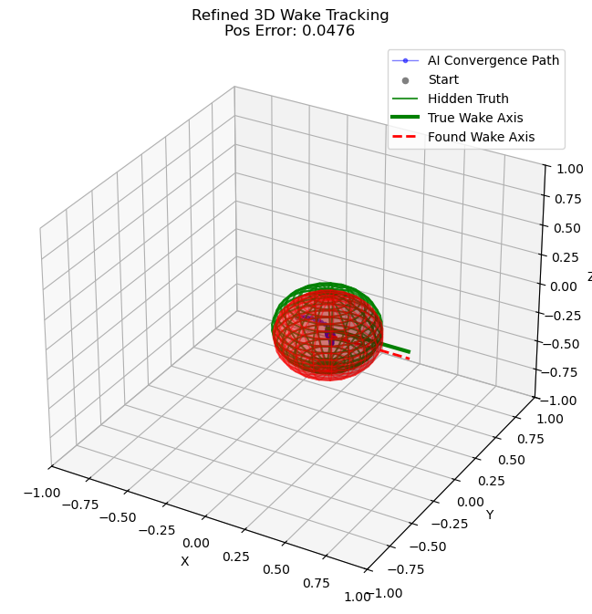

# Convective GenAI Engineering
**Generative Physics & Industrial Tomography**

## 🔬 Project Overview
This repository contains the implementation of **Generative Physics-Informed Flow Matching**, a framework for solving inverse problems in fluid dynamics. By treating physics as a generative process, we move from simple geometric morphing to complex 3D industrial tomography.

## 📂 Model Architecture
The repository is structured into 6 hierarchical experiments, validating the transition from standard Computer Vision to Physics-Informed Neural Networks (PINNs).

| ID | Model Name | Description | Physics/Math Basis |
| :--- | :--- | :--- | :--- |
| **01** | **Toy Shape Morphing** | Morphs a Circle distribution into a Square. | ODE Flow Matching |
| **02** | **MNIST Digits Gen** | Generates handwritten digits (0-9) via flow. | Convective Velocity Fields |
| **03** | **Fashion MNIST Gen** | Generates clothing items (T-shirts, Boots). | High-Dim Image U-Net |
| **04** | **2D Laminar/RANS** | **(Core Thesis)** Detects non-convex obstructions (Stars) using Turbulence. | RANS $k-\epsilon$ Turbulence |
| **05** | **2D Unsteady Video** | Locates objects via vortex shedding frequency in video data. | Spatiotemporal PINNs |
| **06** | **3D Volumetric Wake** | **(Final Engine)** 3D Inverse Tomography for pipe flows. | Galilean Wake Tracking |

## 🚀 Quick Start
To run the foundational "Toy Morphing" model:

```bash
# 1. Clone the repo
git clone [https://github.com/piyushpiku/convective-genai-engineering.git](https://github.com/piyushpiku/convective-genai-engineering.git)
cd convective-genai-engineering

# 2. Install dependencies
pip install -r requirements.txt

# 3. Run the model
python 01_Toy_Shape_Morphing/morphing_model.py

## 📊 Results Gallery

| **01. Shape Morphing** | **04. RANS Star Detection (Thesis Core)** |
| :---: | :---: |
|  |  |

| **02. MNIST Digits** | **06. 3D Wake Tracking** |
| :---: | :---: |
|  |  |
